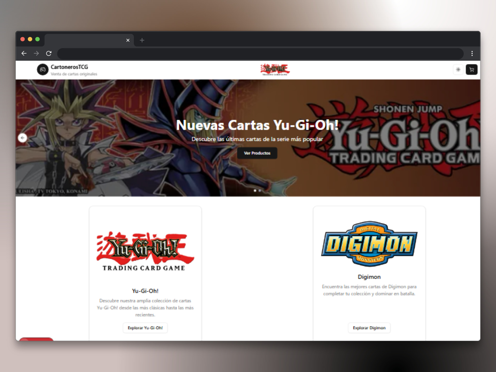
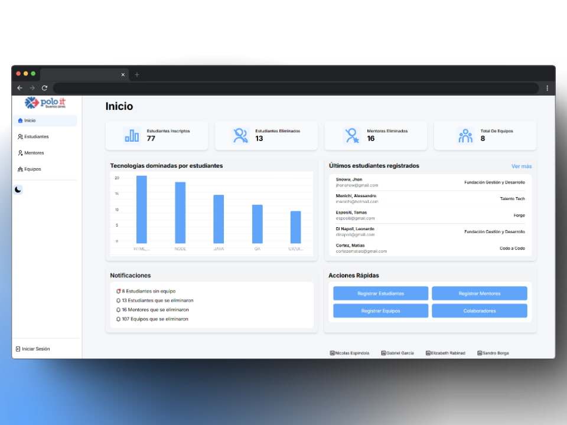
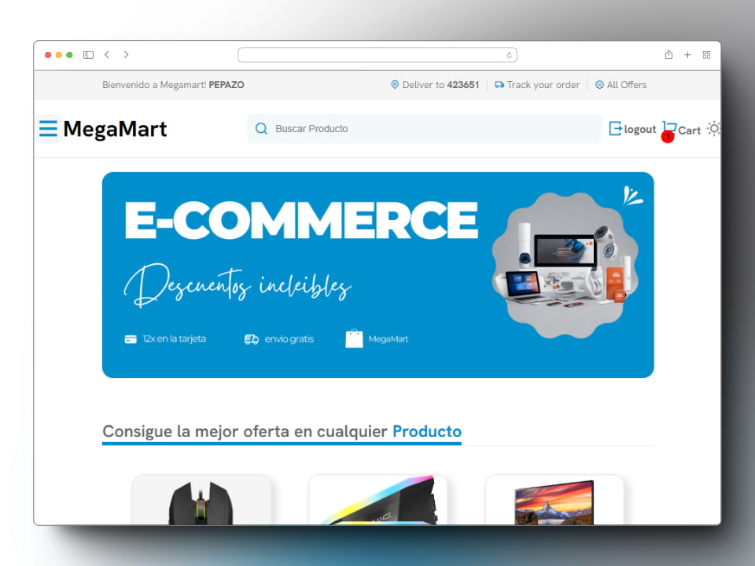

# Portfolio 3.0 - Javier Nicolás Espíndola

Portfolio personal desarrollado con Next.js, TypeScript y Tailwind CSS.  
Incluye presentación profesional, proyectos destacados, stack tecnológico, animaciones y formulario de contacto funcional.

[](https://nextjs.org/)
[](https://react.dev/)
[](https://www.typescriptlang.org/)
[](https://tailwindcss.com/)
[](https://vercel.com/)

## Demo

Sitio en producción:  
👉 [https://espindola-javier.vercel.app](https://espindola-javier.vercel.app)

## Vista previa


### Proyectos destacados

| Proyecto | Imagen |
|---|---|
| E-commerce de Cartas Coleccionables |  |
| Generador de CV con IA |  |
| Gestión de Inscripciones |  |
| E-commerce |  |

## Características

- Hero animado con `framer-motion`
- Navegación responsive con menú móvil
- Sección de proyectos con cards y enlaces
- Sección "Acerca de mí"
- Visualización del stack tecnológico
- Formulario de contacto con validaciones usando `zod`
- Envío de emails con `nodemailer` (Server Actions)
- SEO técnico (Open Graph, Twitter cards, robots, manifest e íconos)
- Animaciones suaves y parallax effects
- Soporte para modo oscuro

## Tecnologías principales

- **Framework:** Next.js 16 (App Router)
- **Lenguaje:** TypeScript
- **UI:** React 19
- **Estilos:** Tailwind CSS 4
- **Animaciones:** Framer Motion
- **Validación:** Zod
- **Email:** Nodemailer
- **Notificaciones:** Sonner
- **Deploy:** Vercel

## Instalación y ejecución local

### 1) Clonar repositorio

```bash
git clone <URL_DEL_REPO>
cd proyect-portfolio-v3.0
```

### 2) Instalar dependencias

```bash
pnpm install
```

> También puedes usar `npm install`, `yarn` o `bun install`.

### 3) Configurar variables de entorno

Crea un archivo `.env.local` en la raíz:

```env
SMTP_HOST=smtp.gmail.com
SMTP_PORT=587
EMAIL_USER=tu_correo@gmail.com
GOOGLE_EMAIL_PASS=tu_password_o_app_password
EMAIL_SEND=correo_destino@dominio.com
PUBLIC_EMAIL_USER=tu_correo@gmail.com
```

**Notas sobre las variables:**
- `SMTP_HOST`: Servidor SMTP (por defecto Gmail)
- `SMTP_PORT`: Puerto SMTP (587 para TLS, 465 para SSL)
- `EMAIL_USER`: Tu correo de Gmail
- `GOOGLE_EMAIL_PASS`: Contraseña de aplicación de Google (no la contraseña normal)
- `EMAIL_SEND`: Correo donde recibirán los mensajes del formulario
- `PUBLIC_EMAIL_USER`: Alternativa opcional para EMAIL_USER

### 4) Levantar entorno de desarrollo

```bash
pnpm dev
```

Abrir en: [http://localhost:3000](http://localhost:3000)

## Scripts disponibles

```bash
# Desarrollo
pnpm dev

# Compilar para producción
pnpm build

# Iniciar servidor de producción
pnpm start

# Linting
pnpm lint
```

## Estructura del proyecto

```
proyect-portfolio-v3.0/
├── app/
│   ├── layout.tsx          # Layout principal con metadata SEO
│   ├── page.tsx            # Página de inicio
│   └── globals.css         # Estilos globales
│
├── components/
│   ├── animated-silhouette-hero.tsx    # Hero principal con animaciones
│   ├── navigation.tsx                  # Navbar responsive
│   ├── projects.tsx                    # Sección de proyectos
│   ├── project-card.tsx                # Card individual de proyecto
│   ├── ray3-section.tsx                # Sección "Acerca de mí"
│   ├── technologies.tsx                # Visualización del stack
│   ├── contact.tsx                     # Formulario de contacto
│   ├── footer.tsx                      # Footer con enlaces sociales
│   ├── buttonForm.tsx                  # Botón submit del formulario
│   └── ui/                             # Componentes UI reutilizables
│       ├── input.tsx
│       ├── textarea.tsx
│       ├── label.tsx
│       └── button.tsx
│
├── lib/
│   ├── actions.ts                      # Server actions (validación de formulario)
│   ├── constants.ts                    # Constantes (proyectos, tecnologías, links)
│   ├── definitions.ts                  # Tipos TypeScript
│   ├── utils.ts                        # Funciones utilitarias
│   ├── config/
│   │   └── emailConfig.ts              # Configuración de email
│   └── service/
│       └── emailService.ts             # Servicio de envío de email
│
├── public/
│   ├── images/                         # Imágenes del portfolio
│   ├── favicon.ico
│   ├── manifest.json
│   ├── robots.txt
│   └── site.webmanifest
│
├── package.json
├── tsconfig.json
├── tailwind.config.ts
├── postcss.config.mjs
├── next.config.ts
└── README.md
```

## Secciones del sitio

### 🎯 Hero
Presentación visual animada con silueta, efectos parallax y carrusel de tecnologías en móvil.

### 📋 Proyectos
7 proyectos destacados con tarjetas interactivas, descripción, tecnologías utilizadas y enlaces a demo/GitHub.

### 🛠️ Stack Tecnológico
Visualización dinámica de todas las herramientas y tecnologías que domino.

### 📝 Acerca de mí
Sección con información profesional, experiencia y visión como desarrollador.

### 📧 Contacto
Formulario funcional con validaciones, envío de emails y notificaciones de éxito/error.

### 🔗 Footer
Enlaces a redes sociales (LinkedIn, GitHub) y datos de contacto.

## Funcionalidades principales

### Validación de formulario
Usando `zod` se validan:
- Nombre: 2-50 caracteres, solo letras y caracteres especiales permitidos
- Email: formato válido, 6-50 caracteres
- Mensaje: 10-500 caracteres

### Envío de emails
Con `nodemailer` se envían emails automáticamente cuando el formulario es válido.

### Animaciones
- Framer Motion para transiciones suaves
- Parallax effects en scroll
- Animaciones de entrada al viewport
- Efectos hover en componentes

### SEO
- Metadata completa (Open Graph, Twitter cards)
- Robots.txt y sitemap
- Icons y manifest para PWA
- URLs canónicas

## Despliegue

La forma recomendada es con **Vercel**:

1. Conectar el repositorio en [Vercel](https://vercel.com)
2. Configurar variables de entorno:
   - `SMTP_HOST`
   - `SMTP_PORT`
   - `EMAIL_USER`
   - `GOOGLE_EMAIL_PASS`
   - `EMAIL_SEND`
   - `PUBLIC_EMAIL_USER`
3. Deploy automático en cada push a la rama principal

**Alternativas de despliegue:**
- Render
- GitHub Pages
- Cualquier hosting que soporte Next.js

## Desarrollo

### Agregar nuevo proyecto

Editar `lib/constants.ts` y agregar objeto a array `projects`:

```typescript
{
  title: "Tu Proyecto",
  description: "Descripción breve",
  image: "/images/tu-imagen.jpg",
  tags: ["Tech1", "Tech2"],
  liveUrl: "https://...",
  githubUrl: "https://...",
}
```

### Agregar nueva tecnología

Agregar a array `technologies` en `lib/constants.ts`:

```typescript
{
  name: "Tu Tech",
  Icon: TuIcono,
  positionClass: "right-8 top-16",
}
```

## Contacto

- **LinkedIn:** [javier-espindola](https://linkedin.com/in/javier-espindola/)
- **GitHub:** [@Micolash89](https://github.com/Micolash89)
- **Email:** [espindolajavier2013@gmail.com](mailto:espindolajavier2013@gmail.com)
- **Ubicación:** Buenos Aires, Argentina

---

Hecho con dedicación por **Javier Nicolás Espíndola** 🚀
